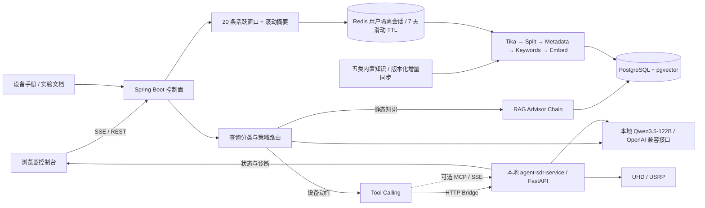

# Wireless Lab Agent（无线实验室智能体）

基于 Spring Boot、Spring AI、本地 Qwen3.5-122B、PGVector、Redis 与 Agent_SDR 的无线通信实验室设备控制与知识智能体。系统把知识检索、设备状态与 USRP 实验操作统一到聊天入口，形成“意图识别 → RAG/工具路由 → 设备执行 → 状态反馈”闭环。

项目面向无线通信实验室的知识查询与设备控制场景，并以 [Agent_SDR](https://github.com/GIN4869623/Agent_SDR) 提交 `fdb5673` 为硬件执行面参考，在本仓库中整理为独立的 `agent-sdr-service/`。

## 核心能力

- 多策略 RAG：单查询、Query Rewrite、历史压缩、多查询扩展，以及“低阈值粗召回 → 去重 → DashScope Rerank 精排”。
- 本地大模型：Java 控制面与 Agent_SDR 均通过 OpenAI 兼容接口调用实验室部署的 Qwen3.5-122B，业务对话不依赖云端 Chat API。
- 请求路由：原理/规格/实验流程走 RAG；设备状态、扫频、发射、调制解调和停止请求走 Tool Calling。
- Agent_SDR 双通道：默认通过 HTTP Agent Bridge 调用 FastAPI；启用 MCP 后直接加载 Agent_SDR 的 USRP 工具。
- USRP 能力：扫频测底噪、Tone 可视化、2-FSK/BPSK/QPSK/16-QAM 文本收发、自适应调制、认知选频和任务停止。
- 异步知识入库：上传文档后立即返回任务 ID，Redis List 消费者异步完成 Tika 解析、切片、关键词增强和 PGVector 写入。
- 分层会话记忆：Redis 保留最近 20 条精确消息，更早消息异步合并为滚动摘要；所有会话键按用户隔离并采用 7 天滑动 TTL。
- 设备态势面板：浏览器每 3 秒轮询 Agent_SDR，展示连接状态、中心频率、采样率、增益、调制方式和诊断信息。
- RAG 评估：49 条标注到具体知识来源的 SDR 问题，计算 Hit Rate、Recall、Precision、MAP、NDCG、MRR；生成评测使用实际检索上下文并设置质量门槛。
- 故障降级：路由器异常回退单查询；查询变换失败回退原始查询；多查询、Rerank、PGVector 分别降级为单查询、粗排和无 RAG 回答。

## 原项目能力复用

| 组件 | 复用情况 | 当前作用 |
|---|---|---|
| Advisors | 保留并接入 | Permission、Memory、日志、RE2，以及单查询、重写、翻译、历史压缩、多查询扩展和 Rerank 链路 |
| Java Tools | 场景化改造 | 使用 `SdrHardwareTool` 统一封装状态查询、实验执行和任务停止；简历、PDF、终端等旧工具不接入无线实验链路 |
| Spring AI MCP Client | 保留并接入 | `SDR_MCP_ENABLED=true` 时自动加载 Agent_SDR MCP 工具，关闭时回退 HTTP Bridge |
| Agent_SDR Tools/Skills | 保留并接入 | Python 执行面保留扫频、Tone、文本收发、自适应调制、认知选频和视频流能力 |

## 架构



路由规则：

```text
静态知识问题  → SINGLE / REWRITE / COMPRESS / MULTI RAG → PGVector → LLM
硬件动作请求  → NONE → Agent_SDR MCP 工具或 executeSdrInstruction → UHD
设备状态请求  → getSdrHardwareStatus → Agent_SDR /api/hardware_status
RIS 外部设备  → 已注册的 MCP 工具，不在本地伪造执行结果

降级链路      → MULTI → SINGLE → NONE；Rerank 失败保留粗排结果
```

## 技术栈

| 分层 | 技术 |
|---|---|
| 控制面 | Java 21、Spring Boot 3.4.4、Spring AI 1.1.2、Spring AI Alibaba 1.1.2.0 |
| 模型 | 本地 Qwen3.5-122B Chat；DashScope Embedding / Rerank |
| 检索 | PostgreSQL 17、pgvector、HNSW、Apache Tika |
| 状态与队列 | Redis List、Redis ChatMemory |
| 硬件执行面 | Agent_SDR、FastAPI、UHD、NumPy |
| 工具协议 | Spring AI Tool Calling、MCP SSE |
| 前端 | HTML、CSS、JavaScript、SSE |

## 项目结构

```text
wireless-lab-agent/
├── .env.example                                  # 环境变量清单（不含密钥）
├── pom.xml                                       # Maven 依赖
├── src/main/java/com/njupt/wirelesslabagent/    # 无线实验室智能体 Java 基础包
│   ├── WirelessLabAgentApplication.java          # 启动类
│   ├── advisor/                                  # RAG/权限/日志 Advisor
│   │   ├── MultiQueryExpansionAdvisor.java       # 多查询扩展、去重和精排
│   │   ├── RewriteQueryAdvisor.java              # 查询重写
│   │   ├── CompressionQueryAdvisor.java          # 多轮追问压缩
│   │   ├── ConversationSummaryAdvisor.java       # 早期对话摘要注入
│   │   ├── ResilientQuestionAnswerAdvisor.java   # 单查询检索失败降级
│   │   ├── RagFallbackSupport.java                # RAG 分阶段降级策略
│   │   └── RerankingDocumentPostProcessor.java   # DashScope Rerank
│   ├── app/
│   │   └── WirelessLabAgentApp.java              # 分类、RAG 路由、工具调用入口
│   ├── chatmemory/
│   │   ├── ConversationKeyFactory.java           # userId + chatId 安全作用域键
│   │   └── RedisChatMemoryRepository.java        # 活跃窗口持久化、淘汰检测与 TTL
│   ├── common/                                   # 请求模型、响应模型和 RAG 策略
│   │   └── RouteLabel.java                        # 七类路由标签与策略映射
│   ├── config/
│   │   ├── ChatClientFactory.java                # 六类 ChatClient/Advisor 链
│   │   ├── ChatMemoryProperties.java             # 窗口、摘要批次和 TTL 配置
│   │   ├── KnowledgeBaseInitializerConfig.java   # 内置 SDR 文档 ETL
│   │   ├── PgVectorConfig.java                   # PGVector/HNSW
│   │   └── DashScopeRerankConfig.java            # 精排模型
│   ├── controller/
│   │   ├── AuthController.java                   # 登录与注册
│   │   ├── ChatController.java                   # SSE 对话与停止输出
│   │   ├── ChatHistoryController.java            # Redis 会话历史
│   │   ├── HardwareController.java               # 设备状态、可视化和停止
│   │   └── KnowledgeController.java              # 文档上传与任务查询
│   ├── exception/                                # 统一业务异常处理
│   ├── service/
│   │   ├── AgentSdrClient.java                   # Agent_SDR HTTP Bridge
│   │   ├── ConversationHistoryService.java       # 用户会话索引与标题
│   │   ├── ConversationSummaryService.java       # 待摘要原文与滚动摘要
│   │   ├── QueryRoutingService.java               # 规则、模型分类和异常回退
│   │   ├── KnowledgeDocumentService.java         # Redis 异步知识入库
│   │   ├── KnowledgeMetadataResolver.java        # 五类知识与元数据统一解析
│   │   ├── ChatStreamSessionManager.java         # 流式会话中断
│   │   └── UserService.java                      # 本地用户与登录会话
│   └── tools/
│       └── SdrHardwareTool.java                  # HTTP 兜底硬件工具
├── src/main/resources/
│   ├── application.yml                           # 环境变量化配置
│   ├── prompts/wireless-lab-system-prompt.st     # 工具与安全边界
│   ├── document/
│   │   ├── sdr-basics.md                         # SDR 基础概念
│   │   ├── modulation-link-design.md             # 调制、同步和链路设计
│   │   ├── usrp-2943-guide.md                    # USRP-2943 官方规格摘要
│   │   ├── wireless-experiment-workflows.md      # 实验执行流程
│   │   ├── agent-sdr-capability-guide.md         # MCP/硬件工具能力目录
│   │   ├── uhd-troubleshooting-guide.md          # UHD/网络/解调故障诊断
│   │   └── rf-experiment-safety.md               # 射频回环、发射和供电安全
│   └── static/                                   # 聊天与设备态势前端
├── agent-sdr-service/                            # 从 Agent_SDR 提取的本地 Python 执行面
│   ├── src/                                      # Agent Loop、FastAPI、MCP、Skill 注册
│   ├── hardware/                                 # UHD/USRP 与 GNU Radio 控制
│   ├── skill/                                    # 无线实验 Skill 定义
│   ├── core/                                     # 会话记忆与知识应用客户端
│   ├── tools/                                    # Skill 请求模型与兼容工具封装
│   ├── static/                                   # 独立 SDR Web 控制台
│   ├── data/                                     # SDR/USRP 知识资料
│   └── scripts/                                  # PDF 知识提取脚本
├── src/test/java/com/njupt/wirelesslabagent/
│   ├── WirelessLabAgentApplicationTests.java
│   ├── chatmemory/
│   │   ├── ConversationKeyFactoryTest.java       # 用户作用域与防碰撞测试
│   │   ├── RedisChatMemoryRepositoryTest.java    # 窗口淘汰检测测试
│   │   └── RedisChatMemoryIntegrationTest.java   # 真实 Redis 隔离、窗口和 TTL 联调
│   ├── service/
│   │   ├── KnowledgeMetadataResolverTest.java    # 分类与元数据单元测试
│   │   ├── QueryRoutingServiceTest.java           # 标签映射与异常回退
│   │   └── QueryRoutingEvaluationTest.java        # Accuracy/Macro-F1/混淆矩阵
│   ├── advisor/
│   │   └── RagFallbackSupportTest.java            # 变换/检索/精排故障注入
│   ├── evaluation/
│   │   ├── RetrievalMetrics.java                  # 来源级检索指标公式
│   │   └── RetrievalMetricsTest.java              # 去重与排序指标验证
│   └── test/
│       ├── PgVectorRetrievalTest.java            # PGVector 检索验证
│       ├── RagEvaluationTest.java                # 49 条来源级 SDR RAG 评测集
│       ├── RagTest.java
│       ├── RedisMemoryTest.java                  # Redis 记忆验证
│       └── ToolTest.java                         # 离线错误不伪造测试
└── Note/                                         # Spring AI/RAG 学习笔记
```

## 本地启动

### 1. 准备基础服务

创建 PostgreSQL 数据库 `wireless_lab_agent` 并安装 `vector` 扩展，启动 Redis。将 `.env.example` 中的变量配置到系统环境；Spring Boot 不会从 `.env` 文件自动读取。

PowerShell 示例：

```powershell
$env:LOCAL_LLM_BASE_URL='http://127.0.0.1:11434/v1'
$env:LOCAL_LLM_CHAT_PATH='/chat/completions'
$env:LOCAL_LLM_API_KEY='ollama'
$env:LOCAL_LLM_MODEL='qwen3.5:122b'
$env:DASHSCOPE_API_KEY='your-key'
$env:DB_URL='jdbc:postgresql://localhost:5432/wireless_lab_agent'
$env:DB_USERNAME='admin'
$env:DB_PASSWORD='your-password'
$env:REDIS_HOST='localhost'
```

Java 主服务只把 ChatModel 切到本地 Qwen3.5-122B；当前向量化与 Rerank 仍使用 DashScope，因此知识入库和检索仍需 `DASHSCOPE_API_KEY`。本地服务只要实现 OpenAI 兼容的 `/v1/chat/completions` 即可，底层可以是实验室现有 Ollama、vLLM 或其他推理服务。

### 2. 启动本地 Agent_SDR 执行面

已从上游提交 `fdb5673` 整理到当前项目的 `agent-sdr-service/`，无需再次克隆，也不会修改或推送上游仓库：

```powershell
Set-Location .\agent-sdr-service
python -m venv .venv
.\.venv\Scripts\Activate.ps1
pip install -r requirements.txt
Copy-Item .env.example .env
uvicorn main:app --host 127.0.0.1 --port 8000
```

UHD Python 绑定通常需要按 USRP/UHD 官方方式单独安装。没有 UHD 或未连接设备时，Agent_SDR 只应返回离线/驱动缺失信息，不会产生真实射频测量。

Spring 侧默认使用 HTTP Bridge：

```powershell
$env:AGENT_SDR_BASE_URL='http://127.0.0.1:8000'
$env:SDR_MCP_ENABLED='false'
$env:SDR_AGENT_MODE='think'
```

需要让 Spring AI 直接发现 Agent_SDR MCP 工具时：

```powershell
$env:AGENT_SDR_MCP_URL='http://127.0.0.1:8000/mcp'
$env:SDR_MCP_ENABLED='true'
```

MCP SSE 完整入口为 `/mcp/sse`。

### 会话记忆配置

默认策略为“最近 20 条原文 + 更早内容滚动摘要”，所有 Redis 会话数据在连续 7 天未访问后自动过期。摘要每积累 6 条淘汰消息异步更新一次；更新失败时原文保留在待摘要列表中，后续请求仍可使用。

```powershell
$env:CHAT_MEMORY_WINDOW_SIZE='20'
$env:CHAT_MEMORY_TTL='7d'
$env:CHAT_MEMORY_SUMMARY_BATCH_SIZE='6'
$env:CHAT_MEMORY_SUMMARY_MAX_CHARS='1200'
```

外部仍使用原始 `chatId`；写入 Redis 前会转换为用户作用域的内部 ID，同一个 `chatId` 在不同用户之间不会共享记忆。该改造不自动读取旧版未带用户 ID 的 `chat-memory:{chatId}` 数据，避免把历史数据错误归属给当前用户。

### 3. 启动 Spring Boot

```powershell
.\mvnw.cmd spring-boot:run
```

访问 `http://localhost:8123/api/index.html`。系统按 `source + knowledge_version` 增量同步七份内置 SDR 文档：同版本跳过、旧版本只替换对应内置来源，不删除用户上传的知识。

需要强制重建内置知识时设置一次 `KNOWLEDGE_REBUILD_ON_STARTUP=true`。重建采用“新切片成功写入后再删除同来源旧切片”，不会 `TRUNCATE vector_store`，也不会删除用户上传知识；七份 SDR 知识同步完成后才会清理非 SDR 旧资料。完成后应恢复为 `false`。

### 4. 执行 RAG 与路由评测

先完成知识重建，再执行来源级 RAG 评测：

```powershell
$env:RUN_RAG_EVALUATION='true'
.\mvnw.cmd -Dtest=RagEvaluationTest,PgVectorRetrievalTest test
```

RAG 使用生产单查询参数 `topK=3`、`threshold=0.5`，指标低于配置门槛时测试直接失败。路由评测输出 Accuracy、Macro-F1 和混淆矩阵：

```powershell
$env:RUN_ROUTE_EVALUATION='true'
.\mvnw.cmd -Dtest=QueryRoutingEvaluationTest test
```

两项评测默认不随普通单元测试运行，避免在 CI 或未启动本地 Qwen3.5-122B 时产生无效结果。

## 主要接口

| 方法 | 路径 | 作用 |
|---|---|---|
| POST | `/api/chat` | SSE 流式问答/实验控制 |
| POST | `/api/chat/stop` | 中止当前模型输出 |
| GET | `/api/hardware/status` | Agent_SDR 与 USRP 状态 |
| GET | `/api/hardware/visualization` | IQ/FFT 可视化快照 |
| POST | `/api/hardware/stop` | 停止并释放硬件任务 |
| POST | `/api/knowledge/upload` | 提交异步知识入库任务 |
| GET | `/api/knowledge/categories` | 查询五类标准知识分类 |
| GET | `/api/knowledge/result/{taskId}` | 查询入库状态与切片数 |

## 验证

```powershell
.\mvnw.cmd test

# 完整 Spring 上下文需要 DashScope、PostgreSQL、Redis 和本地模型均可用
$env:RUN_APPLICATION_CONTEXT_TEST='true'
.\mvnw.cmd -Dtest=WirelessLabAgentApplicationTests test

$env:RUN_REDIS_INTEGRATION_TESTS='true'
.\mvnw.cmd -Dtest=RedisChatMemoryIntegrationTest test
```

真实硬件功能必须在连接 USRP、安装 UHD 且满足射频安全与当地频谱规定的环境中验证。任何发射实验应使用合适的天线、衰减器或屏蔽链路。
